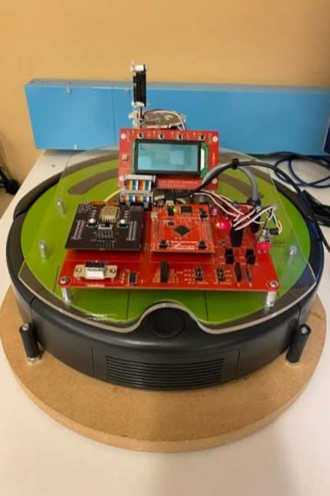
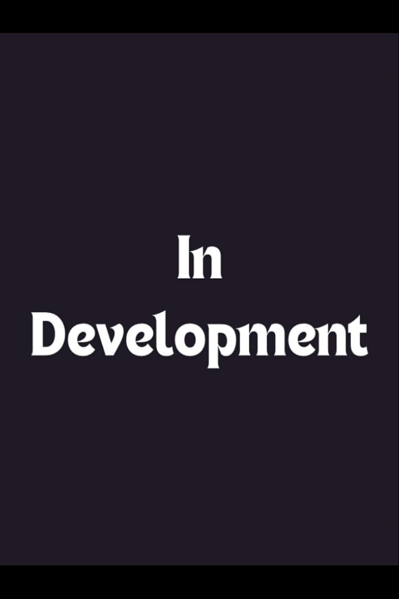
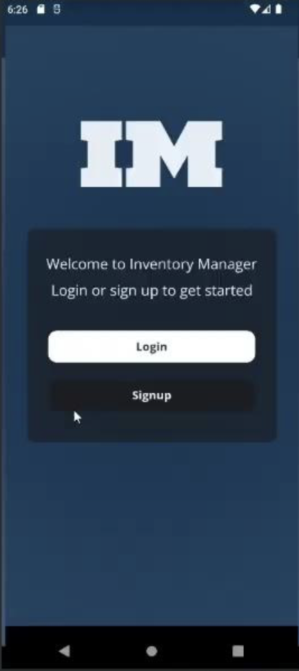
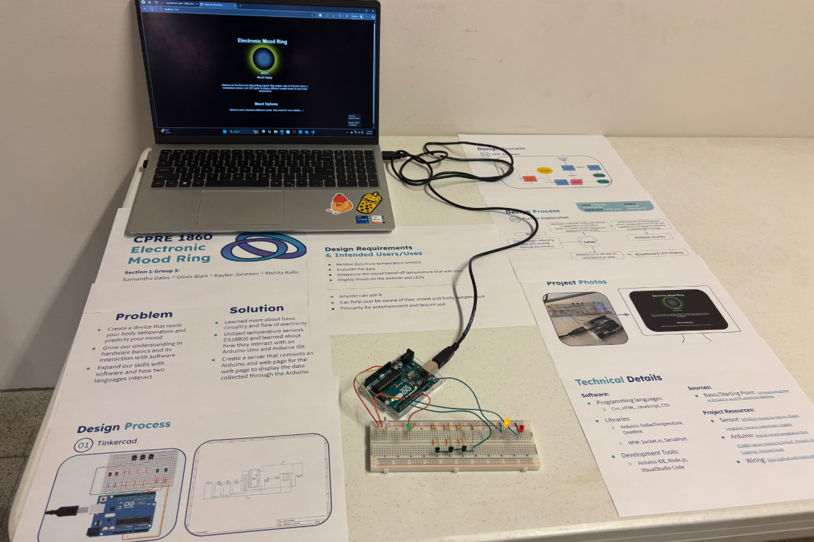
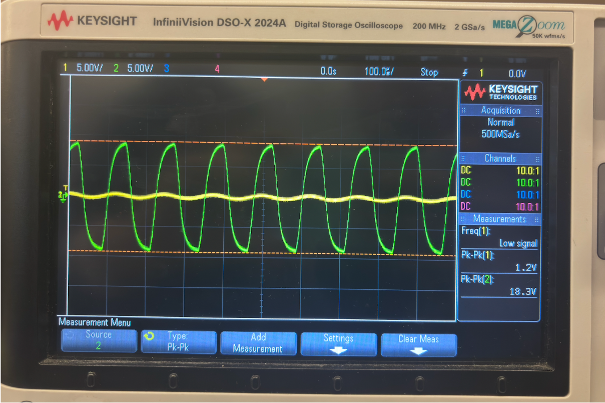
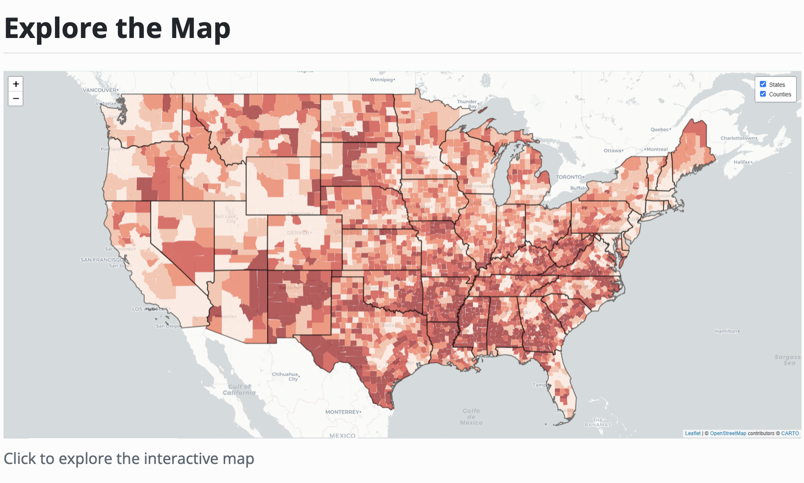
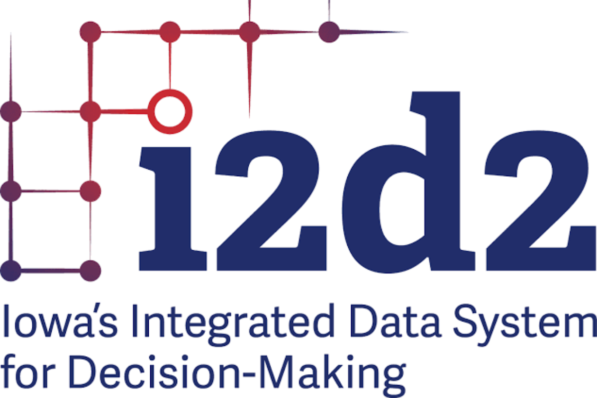
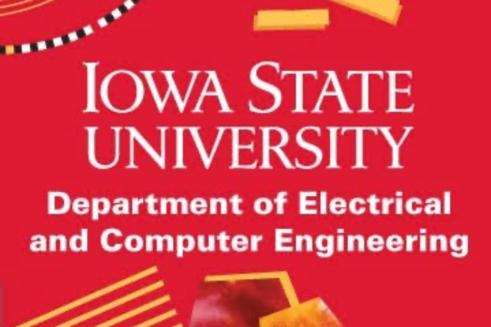
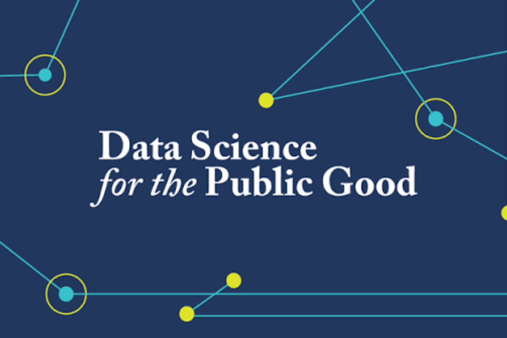

# Rishita Kollu

### Computer Engineering Honors Student • Firmware Engineering • Cybersecurity • Data Science  

[LinkedIn](https://www.linkedin.com/in/kollurishita/) •
[Email](mailto:rishitaa@iastate.edu) 

---

## About Me

I've always been curious about how things work beneath the surface. That curiosity led me to embedded systems, where hardware, firmware, and software come together, and eventually to cybersecurity, where understanding systems is just as important as protecting them.

I'm a junior at Iowa State University majoring in Computer Engineering with a minor in Cybersecurity Engineering. I'm especially interested in firmware engineering, embedded systems, product security and data-driven engineering. I enjoy understanding how hardware and software interact, building systems from the ground up, and learning how they can be made more secure, reliable, and resilient.

Along the way, I've also gained experience in software development, data science, and engineering research through internships and academic projects. Those experiences have strengthened my problem-solving skills and given me a broader perspective.

> This GitHub profile serves as my engineering portfolio, documenting selected projects, research, industry experience, and technical coursework.

---

## Contents

- [Projects](#projects)
- [Work Experience](#work-experience)
- [Laboratory Work](#laboratory-work)
- [Skills](#skills)
- [Leadership & Involvement](#leadership--involvement)
- [Contact](#contact)

---

# Projects

## Featured Projects

<table>
<tr>

<td width="33%" valign="top" align="center">

<h3>Nyx – Autonomous Security Patrol Robot</h3>

Autonomous embedded security robot developed using a Tiva TM4 microcontroller, featuring obstacle detection, sensor scanning, real-time mapping, remote control, and live camera monitoring.

  <strong>Embedded C • Tiva TM4 • UART • I2C • Robotics</strong>

<a href="https://github.com/rishitaa25/autonomous-security-patrol-robot">
  <strong>View Project →</strong>
</a>

</td>

<td width="33%" valign="top" align="center">

<h3>Secure Smart-Grid Controller</h3>

Secure embedded controller combining device communication, runtime attack detection, and cyber-physical security concepts for Industrial IoT and smart-grid environments.

  <strong>Embedded Systems • Networking • Rpi • IIoT</strong>

  <strong>In Development</strong>

</td>

<td width="33%" valign="top" align="center">

<h3>Inventory Manager</h3>

Full-stack warehouse management application supporting inventory operations, shipment scheduling, employee shifts, role-based access, SQL database integration, and real-time communication.

  <strong>Java • Spring Boot • SQL • REST APIs • WebSockets</strong>

<a href="https://github.com/rishitaa25/inventory-manager">
  <strong>View Project →</strong>
</a>

</td>

</tr>
</table>

 

## Additional Projects

<table>
<tr>

<td width="33%" valign="top" align="center">

<h4>Electronic Mood Ring</h4>

Arduino-based embedded system that reads temperature data, maps the readings to predefined moods, and displays the result through a real-time interactive web interface.

  <strong>Arduino • C++ • JavaScript • Node.js • HTML</strong>

<a href="https://github.com/rishitaa25/mood-ring">
  <strong>View Project →</strong>
</a>

</td>

<td width="33%" valign="top" align="center">

<h4>Two-Channel Stereo Headphone Amplifier</h4>

Designed, built, and tested an analog stereo amplifier with independent channel volume control, a 100 Hz–15 kHz bandpass response & a target passband gain of 20 V/V.

  <strong>Analog Circuits • Op-Amps • Filters • LTspice • Oscilloscope</strong>

<a href="https://github.com/rishitaa25/stereo-headphone-amplifier.git">
  <strong>View Project →</strong>
</a>

</td>

<td width="33%" valign="top" align="center">

<h4>Digital Exclusion Across the United States</h4>

Analyzed American Community Survey data to identify geographic disparities in household internet access and developed interactive maps highlighting digitally excluded states and counties.

  <strong>R • Python • Leaflet • ACS Data • GIS • Data Visualization</strong>

<a href="https://github.com/rishitaa25/census-analysis.git">
  <strong>View Project →</strong>
</a>

</td>

</tr>
</table>

  
    Click a project image or project link to view its source code, documentation, design process, testing results, and implementation details.
  

---

# Work Experience

<table>
<tr>

<td width="22%" align="center" valign="middle">

</td>

<td width="78%" valign="top">

<h3>Emerson</h3>

<strong>Product Security Intern</strong> 
May 2026 – August 2026

Performed security assessments on embedded industrial products through firmware, hardware, USB, and network testing.

<strong>Read more</strong>

Built a Raspberry Pi-based man-in-the-middle testing platform by configuring a custom wireless access point and using mitmproxy to intercept, log, and inspect communication between embedded devices and the network.

Developed and tested FreeRTOS firmware in C++ for an ESP32-based industrial embedded device, working with real-time tasks, hardware constraints, and peripheral behavior through the Arduino IDE.

Debugged target hardware through SWD, analyzed firmware images using Binwalk, and tested Ethernet/IP, storage, UART, GPIO, and USB interfaces. Simulated attack scenarios using tools such as Wireshark, Nmap, Kali Linux, and USB Rubber Ducky payloads to identify firmware and device-security issues.

<strong>Technologies:</strong> C++ • FreeRTOS • ESP32 • Arduino IDE • Python • Raspberry Pi • Embedded Linux • SWD • mitmproxy • Wireshark • Binwalk • Nmap • Kali Linux • Ethernet/IP • UART • GPIO • USB • Firmware Security

</td>

</tr>
</table>

 

<table>
<tr>

<td width="22%" align="center" valign="middle">

</td>

<td width="78%" valign="top">

<h3>Iowa Integrated Data System for Decision-Making</h3>

<strong>Undergraduate Program Assistant</strong> 
December 2025 – Present

Developed public-sector data products using R and Python by transforming, cleaning, and analyzing large administrative datasets.

<strong>Read more</strong>

Build automated data-processing workflows, generate county- and statewide-level reports, and contribute to dashboards and visualization tools used by researchers and community partners.

Projects include data automation, geographic reporting, census-based analyses, and interactive reporting for statewide initiatives supporting education and early childhood programs.

Used GitHub Copilot and prompt-based AI tools to understand unfamiliar code, troubleshoot errors, compare implementation approaches, and support refactoring while reviewing all generated code before using it. Maintained project changes through Git and tested outputs against source data and expected results.

<strong>Technologies:</strong> R • Python • SQL • Data Visualization • Census Data • GIS • Statistical Analysis • Automation • Prompt Engineering

<a href="https://i2d2.iastate.edu/ia-data-drive/">
  📊 <strong>Iowa Data Drive</strong> 
</a>

</td>

</tr>
</table>

 

<table>
<tr>

<td width="22%" align="center" valign="middle">

</td>

<td width="78%" valign="top">

<h3>Power Systems Laboratory</h3>

<strong>Research Intern</strong> 
January 2025 – May 2026

Conducted research supporting transmission-system planning by processing, validating, and visualizing large-scale electrical grid datasets. 

<strong>Read more</strong>

Developed Python and SQL workflows to automate data matching, integrate GIS information, and improve the accuracy of transmission network models used for renewable energy and infrastructure research.

<strong>Technologies:</strong> Python • SQL • GIS • Power Systems • Data Processing • Data Visualization • Automation

</td>

</tr>
</table>

 

<table>
<tr>

<td width="22%" align="center" valign="middle">

</td>

<td width="78%" valign="top">

<h3>Iowa State University</h3>

<strong>Teaching Assistant, Biomedical Engineering (BME 3400)</strong> 
August 2025 – December 2025

Assisted students with Python programming, debugging, and computational problem solving in biomedical engineering coursework involving numerical methods, scientific computing, and data analysis.

<strong>Read more</strong>

Guided students through mathematical modeling topics including numerical integration, interpolation, curve fitting, differential equations, sampling, estimation, and error analysis during labs and office hours.

Supported laboratory sessions, answered programming questions, tested and debugged student code, graded homework assignments and exams, and provided feedback to help students develop stronger computational problem-solving skills.

<strong>Technologies:</strong> Python • Scientific Computing • Numerical Methods • Mathematical Modeling • Data Analysis • Debugging • Computational Engineering

</td>

</tr>
</table>

 

<table>
<tr>

<td width="22%" align="center" valign="middle">

</td>

<td width="78%" valign="top">

<h3>Data Science for the Public Good</h3>

<strong>Data Science Intern</strong> 
May 2025 – August 2025

Worked on interdisciplinary data science projects addressing real-world public policy challenges using large public datasets.

<strong>Read more</strong>

Investigated STEM trends across Iowa using Python, R, SQL, and interactive Shiny dashboards, combining education, workforce, and geographic data into a public-facing research product.

Worked in a shared Git repository by creating feature branches, reviewing commit history, resolving merge conflicts, comparing file changes, restoring earlier versions, and using tools such as cherry-pick when selected updates needed to be moved between branches.

Debugged data and application issues across the project, including broken joins, inconsistent column formats, Shiny errors, and conflicts caused by multiple contributors editing the same files. Presented the final research at the Summer Research Symposium and contributed to the published project report.

<strong>Technologies:</strong> R • Python • SQL • GIS • Leaflet • Shiny • Census Data • Data Visualization • Statistical Analysis • Data Debugging • Version Control

<a href="https://dspg-2025.github.io/Public-Page/blogs2025/Final_Blog/final-blog-stem-ed/Weekly_Team_Blog.html">
  📝 <strong>Project Blog: From Classroom to Career: The Status of STEM in Iowa </strong> 
</a>

 

<a href="https://www.youtube.com/watch?v=C57MaN7fd7k">
  🎥 <strong>Presentation Video </strong> 
</a>

</td>

</tr>
</table>

 

<table>
<tr>

<td width="22%" align="center" valign="middle">

</td>

<td width="78%" valign="top">

<h3>Ames National Laboratory</h3>

<strong>SCIENCES Research Intern</strong> 
September 2024 – May 2025

Contributed to the development of HOODLT, a Python-based molecular dynamics simulation package used for nanoparticle research.

<strong>Read more</strong>

Improved software functionality, developed reusable modules, enhanced compatibility with modern simulation workflows, and assisted in testing and maintaining scientific computing tools for researchers.

<strong>Technologies:</strong> Python • Molecular Dynamics • Scientific Computing • Software Development • Data Analysis

</td>

</tr>
</table>

---

# Laboratory Work

> **Repository Access Notice**
>
> To preserve academic integrity and comply with university course policies, the source code, laboratory reports, and implementation details for certain course laboratories are maintained in private repositories.
>
> If you are a recruiter, hiring manager, or faculty member and would like to review a specific laboratory repository, please feel free to contact me. I am happy to provide access for professional evaluation upon request.
>
> 📧 **Request Repository Access:** [Email Me](mailto:rishitakollu@gmail.com?subject=GitHub%20Laboratory%20Repository%20Access)

<table>

<tr>
<td width="100%">

<h3>Embedded Systems Laboratory (CPRE 2880)</h3>

Designed and programmed embedded systems using the Tiva TM4 microcontroller, integrating sensors, actuators, communication peripherals, and autonomous robotic functionality.

<strong>Embedded C • Tiva TM4 • UART • ADC • I2C • Timers</strong>

</td>
</tr>

<tr>
<td>

<h3>Penetration Testing Laboratory (CYBE 2310)</h3>

Performed hands-on security assessments through vulnerability discovery, exploitation, network analysis, and system hardening exercises in controlled laboratory environments.

<strong>Kali Linux • Metasploit • Wireshark • Nmap • OWASP</strong>

</td>
</tr>

<tr>
<td>

<h3>Electronic Circuits & Systems Laboratory (EE 2300)</h3>

Designed, simulated, built, and tested analog and digital electronic circuits while applying measurement techniques and engineering design principles.

<strong>Op-Amps • Analog Circuits • LTspice • Oscilloscope • Circuit Design</strong>

</td>
</tr>

<tr>
<td>

<h3>Digital Logic Laboratory (CPRE 2810)</h3>

Designed and verified combinational and sequential digital systems using hardware description languages and FPGA-based development tools.

<strong>Verilog • FPGA • Quartus Prime • Digital Design</strong>

</td>
</tr>

<tr>
<td>

<h3>Networking Infrastructure Laboratory (CYBE 2300)</h3>

Configured and analyzed computer networks while exploring routing, switching, communication protocols, packet analysis, and network security concepts.

<strong>TCP/IP • Wireshark • Routing • Switching • Linux</strong>

</td>
</tr>

</table>

---

# Skills

<table>
<tr>

<td width="25%" valign="top">

### Embedded Systems

- Embedded C/C++
- Microcontrollers
- Tiva TM4
- ESP32
- Arduino
- Raspberry Pi
- UART
- I2C
- ADC
- Servo control
- SWD Debugging
- Sensor integration
- ARM assembly
- FreeRTOS

</td>

<td width="25%" valign="top">

### Cybersecurity

- Product security
- Penetration testing
- Firmware analysis
- Reverse engineering
- Network traffic analysis
- Fuzz testing
- Vulnerability assessment
- Hardware security testing
- Secure communication
- Threat modeling

</td>

<td width="25%" valign="top">

### Software Development

- Python
- C
- Java
- JavaScript
- Spring Boot
- REST APIs
- WebSockets
- SQL
- JDBC
- Git and GitLab
- Agile/SCRUM
- Software testing

</td>

<td width="25%" valign="top">

### Data & Research

- R
- Python
- SQL
- R Shiny
- Data cleaning
- Data visualization
- GIS data
- Scientific computing
- Workflow automation
- Technical reporting
- Research communication

</td>

</tr>
</table>

### Tools & Platforms

`Wireshark` `Kali Linux` `Metasploit` `Nmap` `Binwalk` `Git` `GitLab` `Bitbucket` `Quartus Prime` `QuestaSim` `RStudio` `Linux` `Raspberry Pi`

---

# Leadership & Involvement

<table>
<tr>

<td width="50%" valign="top">

### Academic Leadership

- Teaching Assistant, BME 3400
- First-Year Honors Program Leader
- WiSE Peer Facilitator
- Engineering Honors Program
- Alpha Lambda Delta Honor Society

</td>

<td width="50%" valign="top">

### Campus Involvement

- Director, Engineering Career Fair
- Secretary, Honors Student Board
- Peer mentoring and student support
- Technical presentations and research communication
- Collaborative project leadership

</td>

</tr>
</table>

---

# Contact

I am interested in opportunities involving embedded systems, firmware development, product security, cybersecurity, and low-level software engineering.

- **Email:** [rishitaa@iastate.edu](mailto:rishitaa@iastate.edu)
- **LinkedIn:** [Rishita Kollu](https://www.linkedin.com/in/kollurishita/)
- **GitHub:** [github.com/rishitaa25](https://github.com/rishitaa25)

---

### Thank you for visiting my portfolio.

This portfolio is continuously updated as I complete new projects, research, coursework, and technical experiences.

