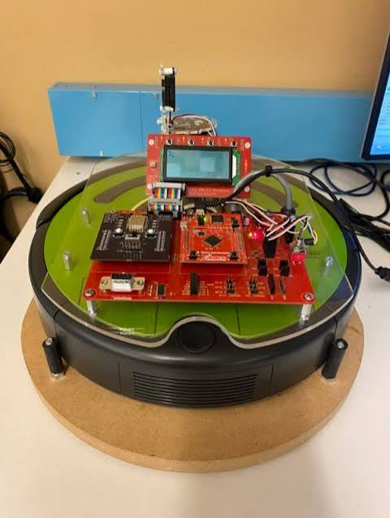

# Rishita Kollu

### Computer Engineering Honors Student • Firmware Engineering • Cybersecurity • Data Science •  Iowa State University 

[LinkedIn](https://www.linkedin.com/in/kollurishita/) •
[Email](mailto:rishitaa@iastate.edu) 

---

## About Me

I've always been curious about how things work beneath the surface. That curiosity led me to embedded systems, where hardware, firmware, and software come together, and eventually to cybersecurity, where understanding systems is just as important as protecting them.

I'm a junior at Iowa State University majoring in Computer Engineering with a minor in Cybersecurity Engineering. I'm especially interested in firmware engineering, embedded systems, product security and data-driven engineering. I enjoy understanding how hardware and software interact, building systems from the ground up, and learning how they can be made more secure, reliable, and resilient.

Along the way, I've also gained experience in software development, data science, and engineering research through internships and academic projects. Those experiences have strengthened my problem-solving skills and given me a broader perspective.

> This GitHub profile serves as my engineering portfolio, documenting selected projects, research, industry experience, and technical coursework.

---

## Contents

- [Projects](#projects)
- [Work Experience](#work-experience)
- [Laboratory Work](#laboratory-work)
- [Skills](#skills)
- [Leadership & Involvement](#leadership--involvement)
- [Contact](#contact)

---

# Projects

<table>
<tr>

<td width="33%" valign="top" align="center">

<h3>Nyx – Autonomous Security Patrol Robot</h3>

Autonomous embedded security robot developed using a Tiva TM4 microcontroller, featuring obstacle detection, sensor scanning, real-time mapping, remote control, and live camera monitoring.

  <strong>Embedded C • Tiva TM4 • UART • I2C • Robotics</strong>

<a href="https://github.com/rishitaa25/autonomous-security-patrol-robot">
  <strong>View Project →</strong>
</a>

</td>

<td width="33%" valign="top" align="center">

<h3>Inventory Manager</h3>

Full-stack warehouse management application supporting inventory operations, shipment scheduling, employee shifts, role-based access, SQL database integration, and real-time communication.

  <strong>Java • Spring Boot • SQL • REST APIs • WebSockets</strong>

<a href="https://github.com/rishitaa25/inventory-manager">
  <strong>View Project →</strong>
</a>

</td>

<td width="33%" valign="top" align="center">

<h3>Electronic Mood Ring</h3>

Arduino-based embedded system that reads temperature data, maps the readings to predefined moods, and displays the result through a real-time interactive web interface.

  <strong>Arduino • C++ • JavaScript • Node.js • HTML</strong>

<a href="https://github.com/rishitaa25/mood-ring">
  <strong>View Project →</strong>
</a>

</td>

</tr>
</table>

 

<table>
<tr>

<td width="33%" valign="top" align="center">

<h3>Secure Smart-Grid Controller</h3>

Secure embedded controller combining device communication, runtime attack detection, and cyber-physical security concepts for Industrial IoT and smart-grid environments.

  <strong>Embedded Systems • Networking • Cybersecurity • IIoT</strong>

<a href="https://github.com/rishitaa25/secure-smart-grid-controller">
  <strong>View Project →</strong>
</a>

</td>

<td width="33%" valign="top" align="center">

<h3>8-Bit CPU and Assembler</h3>

Custom 8-bit processor implemented on an FPGA with a designed datapath, control unit, instruction architecture, assembler, and simulation-based verification.

  <strong>Verilog • FPGA • QuestaSim • Computer Architecture</strong>

<a href="REPLACE_WITH_CPU_REPOSITORY_URL">
  <strong>View Project →</strong>
</a>

</td>

<td width="33%" valign="top" align="center">

<h3>Additional Projects</h3>

More embedded systems, cybersecurity, software engineering, and data science projects are currently being documented and added to this portfolio.

  <strong>Portfolio in Progress</strong>

</td>

</tr>
</table>

  
    Click a project image or project link to view its source code, documentation, design details, and implementation notes.
  

---

---

# Work Experience

<table>
<tr>

<td width="22%" align="center" valign="middle">
  
</td>

<td width="78%" valign="top">

<h3>Emerson</h3>

<strong>Product Security Intern</strong> 
May 2026 – August 2026

Performed security assessments on embedded industrial products through penetration testing, fuzz testing, firmware analysis, and network traffic inspection. Developed reusable Python automation scripts and used Kali Linux, Wireshark, Binwalk, Raspberry Pi, and hardware testing interfaces to evaluate device resilience against hardware, firmware, USB, and network-based attack scenarios.

</td>

</tr>
</table>

 

<table>
<tr>

<td width="22%" align="center" valign="middle">
  
</td>

<td width="78%" valign="top">

<h3>Iowa Integrated Data System for Decision-Making</h3>

<strong>Undergraduate Program Assistant</strong> 
December 2025 – Present

Develop reusable Python and R workflows, interactive dashboards, automated reports, and data-processing tools that transform complex public datasets into clear and accessible information for researchers, community organizations, and stakeholders.

</td>

</tr>
</table>

 

<table>
<tr>

<td width="22%" align="center" valign="middle">
  
</td>

<td width="78%" valign="top">

<h3>Power Systems Laboratory</h3>

<strong>Research Intern</strong> 
January 2025 – May 2026

Processed and validated large-scale power-system datasets using Python and SQL. Developed automated workflows and visual tools to organize transmission lines, substations, GIS information, and engineering data used for long-term grid planning and renewable-energy analysis.

</td>

</tr>
</table>

 

<table>
<tr>

<td width="22%" align="center" valign="middle">
  
</td>

<td width="78%" valign="top">

<h3>Data Science for the Public Good</h3>

<strong>Data Science Intern</strong> 
May 2025 – August 2025

Investigated Iowa's STEM education and workforce pipeline using data analysis, SQL databases, GIS tools, and interactive R Shiny dashboards. Integrated information from multiple public datasets and presented findings at a university research symposium.

</td>

</tr>
</table>

 

<table>
<tr>

<td width="22%" align="center" valign="middle">
  
</td>

<td width="78%" valign="top">

<h3>Ames National Laboratory</h3>

<strong>SCIENCES Research Intern</strong> 
September 2024 – May 2025

Developed and maintained HOODLT, a Python-based nanoparticle molecular-dynamics simulation tool. Improved scientific modules, testing, packaging, maintainability, and compatibility with modern simulation tools including HOOMD-blue.

</td>

</tr>
</table>

---

# Laboratory Work

<table>
<tr>

<td width="33%" valign="top" align="center">

<h3>Embedded Systems Laboratory [CPRE 2880]</h3>

Low-level microcontroller programming, peripheral configuration, sensor communication, interrupts, timers, UART, ADC, I2C, servo control, and autonomous robotic systems.

<strong>Embedded C • Tiva TM4 • UART • ADC • I2C</strong>

<a href="REPLACE_WITH_EMBEDDED_LABS_REPOSITORY_URL"><strong>View Laboratory Work →</strong></a>

</td>

<td width="33%" valign="top" align="center">

<h3>Penetration Testing Laboratory [CYBE 2310]</h3>

Processor design, FPGA implementation, digital logic, datapath and control development, assembly programming, waveform analysis, simulation, and hardware verification.

<strong>Verilog • FPGA • ARM Assembly • QuestaSim</strong>

<a href="REPLACE_WITH_COMPUTER_ARCHITECTURE_LABS_REPOSITORY_URL"><strong>View Laboratory Work →</strong></a>

</td>

<td width="33%" valign="top" align="center">

<h3>Electronic Circuits & Systems Laboratory [EE 2300]</h3>

Hands-on exercises in network reconnaissance, vulnerability analysis, penetration testing, traffic inspection, system hardening, cryptography, and security assessment.

<strong>Kali Linux • Wireshark • Nmap • Metasploit</strong>

<a href="REPLACE_WITH_CYBERSECURITY_LABS_REPOSITORY_URL"><strong>View Laboratory Work →</strong></a>

</td>

</tr>
</table>

 

<table>
<tr>

<td width="33%" valign="top" align="center">

<h3>Digital Logics Laboratory [CPRE 2810]</h3>

Team-based application development using modular design, version control, client-server architecture, database systems, software testing, Agile practices, and continuous integration.

<strong>Java • Spring Boot • SQL • Git • SCRUM</strong>

<a href="REPLACE_WITH_SOFTWARE_LABS_REPOSITORY_URL"><strong>View Laboratory Work →</strong></a>

</td>

<td width="33%" valign="top" align="center">

<h3>Networking Infrastructure Laboratory [CYBE 2300]</h3>

Networking exercises involving communication protocols, client-server systems, packet analysis, IP addressing, routing concepts, sockets, and network-security fundamentals.

<strong>TCP/IP • Wireshark • Sockets • Network Security</strong>

<a href="REPLACE_WITH_NETWORKING_LABS_REPOSITORY_URL"><strong>View Laboratory Work →</strong></a>

</td>

<td width="33%" valign="top" align="center">

<h3>Additional Laboratory Work</h3>

Additional coursework and technical laboratory repositories will be added as documentation is reviewed and prepared for public release.

<strong>Repository Updates in Progress</strong>

</td>

</tr>
</table>

  Course-provided materials are excluded where required. Repositories contain only work that may be shared under applicable academic policies.

---

# Skills

<table>
<tr>

<td width="25%" valign="top">

### Embedded Systems

- Embedded C
- Microcontrollers
- Tiva TM4
- Arduino
- Raspberry Pi
- UART
- I2C
- ADC
- Servo control
- Sensor integration
- ARM assembly
- RTOS fundamentals

</td>

<td width="25%" valign="top">

### Cybersecurity

- Product security
- Penetration testing
- Firmware analysis
- Reverse engineering
- Network traffic analysis
- Fuzz testing
- Vulnerability assessment
- Hardware security testing
- Secure communication
- Threat modeling

</td>

<td width="25%" valign="top">

### Software Development

- Python
- C
- Java
- JavaScript
- Spring Boot
- REST APIs
- WebSockets
- SQL
- JDBC
- Git and GitLab
- Agile/SCRUM
- Software testing

</td>

<td width="25%" valign="top">

### Data & Research

- R
- Python
- SQL
- R Shiny
- Data cleaning
- Data visualization
- GIS data
- Scientific computing
- Workflow automation
- Technical reporting
- Research communication

</td>

</tr>
</table>

### Tools & Platforms

`Wireshark` `Kali Linux` `Metasploit` `Nmap` `Binwalk` `Git` `GitLab` `Bitbucket` `Quartus Prime` `QuestaSim` `RStudio` `Linux` `Raspberry Pi`

---

# Leadership & Involvement

<table>
<tr>

<td width="50%" valign="top">

### Academic Leadership

- Teaching Assistant, BME 3400
- First-Year Honors Program Leader
- WiSE Peer Facilitator
- Engineering Honors Program
- Alpha Lambda Delta Honor Society

</td>

<td width="50%" valign="top">

### Campus Involvement

- Director, Engineering Career Fair
- Secretary, Honors Student Board
- Peer mentoring and student support
- Technical presentations and research communication
- Collaborative project leadership

</td>

</tr>
</table>

---

# Contact

I am interested in opportunities involving embedded systems, firmware development, product security, cybersecurity, and low-level software engineering.

- **Email:** [rishitaa@iastate.edu](mailto:rishitaa@iastate.edu)
- **LinkedIn:** [Rishita Kollu](https://www.linkedin.com/in/kollurishita/)
- **GitHub:** [github.com/rishitaa25](https://github.com/rishitaa25)

---

### Thank you for visiting my portfolio.

This portfolio is continuously updated as I complete new projects, research, coursework, and technical experiences.

